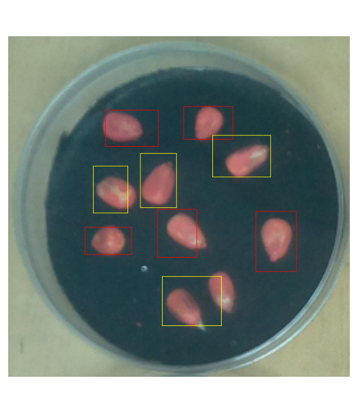

[](LICENSE)
# U-Net network to segment seeds

A neural network cli interface based on the ssd framework used to detect
germinating seeds.

# Installation

To download and use the software execute the following commands
```shell
$ git clone https://github.com/jvech/NeuralSeeds.git
$ cd NeuralSeeds/src
```

### Dependencies
To run __Neural seeds__ you must have installed these python libraries

```
numpy
tensorflow
matplotlib
silence_tensorflow
cv2
docopt
```

# Usage

## Train

Use the following command in order to train the model:

```
Usage:
    train.py [options] <imgs> <annotations> 

Options:
    -h --help               Show this message
    -H --history            Show the history of model metrics
    --model <file>          Save the trained model [default: ./model.h5]
    --batch <int>           Batch size [default: 8]
    --epochs <int>          Number of epochs [default: 40]
    --val_split <float>     Rate of the validation data [default: 0.0]
    --backbone <name>       Select the detector backbone [default: mobilenetv2]
```
__Available backbones__ (`--backbone` option): mobilenetv2, vgg16

## Inference
To make predictions the following command will put the detections in the
standard output:
```
Usage:
    predict.py [options]  <model>

Options:
    -h --help               Show this message
    -s --show               Show the detections in the image
```

## Examples

In this example the model will be trained with a dataset labeled using _cvat_
```shell
$ python train.py GermPredDataset/ZeaMays/* --epochs 3 --model mobilnetv2_20.h5 --val_split 0.3
```

Once the model is trained use the predict command to print the detection in the
standard output, 
```
$ python predict.py GermPredDataset/ZeaMays/img/zm1_1_img060.jpg weigths/mobilnetv2_20.h5 --show

x	y	w	h	cls
140	350	225	400	0
320	129	410	189	0
177	136	274	202	0
281	440	389	530	1
272	317	344	405	0
155	238	218	324	1
241	215	307	314	1
373	182	479	258	1
452	321	526	431	0
```

the `--show` option allows the visualization of the detection:



## References
* [Accurate machine learning-based germination detection, prediction and quality assessment of three grain crops](https://plantmethods.biomedcentral.com/articles/10.1186/s13007-020-00699-x)
